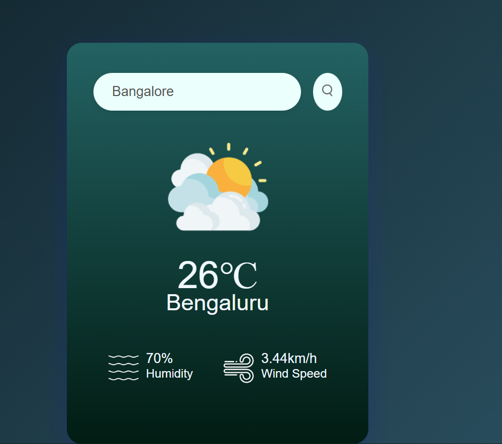

# 🌦️ Weather App

A simple Weather App built with **HTML, CSS, and JavaScript** that fetches real-time weather data using the [OpenWeatherMap API](https://openweathermap.org/api).

---

## 🚀 Features
- 🌍 Get weather updates by city name  
- 🌡️ Shows temperature, humidity, and conditions  
- 🎨 Responsive UI with simple design  

---

## 🖼️ Project UI

### 🔹 Homepage

*(Add a screenshot of your app here – save it as `weather-ui.png` in your `images/` folder and push it.)*

---

## 🛠️ Technologies Used
- **HTML5**  
- **CSS3**  
- **JavaScript (Vanilla JS)**  
- **OpenWeatherMap API**  

---

## 📂 Project Structure

weather-app/
│-- images/
│-- index.html
│-- style.css
